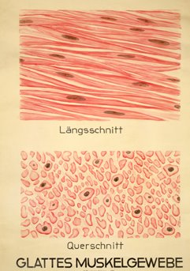

<html>
<ul id="toc">
<h1>
Muskeln
</h1>
<body>
<h2>Definition</h2>
Da es beim Bodybuilding hauptsächlich um das Muskelwachstum geht, ist es wichtig den Aufbau des Muskels zu verstehen.
Ein Muskel ist ein kontraktiles Organ. Es kann durch Zusammenziehen (Kontraktion) und Entspannung (Relaxation) innere und äußere Strukturen des Organismus bewegen, welches die Grundlage der Fortbewegung, der Körpergestaltung und vieler innerer Körperfunktionen des Individuums ist.
<h2>Agonist und Antagonist</h2>
 

Der Agonist  ist der Beugemuskel. Das heißt, er zieht sich zusammen. Ein weiterer Muskel (Streckmuskel) ist für die Gegenbewegung verantwortlich. Dieser Muskel wird Antagonist genannt. Beugen wir unseren Arm, arbeitet der Bizeps also als Agonist, da er sich zusammenzieht. Der Trizeps ist in diesem Fall der Antagonist, da er sich dehnt. Strecken wir den Arm ist es umgekehrt - der Trizeps arbeitet als Agonist und der Bizeps als Antagonist.
<h2>Muskelarten</h2>
Muskeln werden in drei verschiedene Arten von Muskelgruppen unterteilt: das glatte, unwillkürliche Muskelgewebe, das Herzmuskelgewebe und das quergestreifte, willkürliche Muskelgewebe. Das glatte Muskelgewebe ist z.B. für die Verdauung zuständig, während das quergestreifte Muskelgewebe für die Bewegung des Skeletts zuständig ist. Das Herzmuskelgewebe ist im Grunde auch quergestreift, aber nicht willkürlich. Da nur das quergestreifte, willkürliche Muskelgewebe für die Bewegung und somit den Muskelaufbau zuständig ist, werden wir nur auf dieses näher eingehen.
Die Muskulatur besteht hauptsächlich aus diesem willkürlichen Muskelgewebe, das auch Skelettmuskulatur genannt wird. Diese besteht aus vielen Muskelfasern, die wie Röhren dicht aneinander liegen. Sie können bis zu 18 cm lang sein, etwa 1/10 mm dick und können sich bei Kontraktion bis fast um die Hälfte verkürzen. Muskelfasern bestehen aus vielen 100 bis zu 1000 parallel verlaufenden Myofibrillen. Diese sind die eigentlichen kontraktilen Elemente des Muskels, die wiederum aus tausenden von Muskelfilamenten bestehen. Diese Muskelfilamente sind Eiweißstrukturen, die sich abhängig von ihren Proteinbestandteilen in dünne Aktinfilamente oder dicke Myosinfilamente einteilen lassen.
<h1>Muskeln zuhause trainieren </h1>
<h2> Schwingstab</h2>
Manchmal trainieren wir Muskeln, die kennen wir noch nicht einmal, obwohl
wir auf ihre Arbeit angewiesen sind. Während Hanteln und Co. vor allem die oberflächliche
Muskulatur trainieren, trainiert der Schwingstab besonders die Tiefenmuskulatur. Dazu
gehören tief liegende Muskelschichten, die z.B. das Bewegungssystem kontrollieren.
Schwingstäbe helfen, genau diese Muskelregionen zu trainieren: Wenn sich die
Schwingbewegung einmal eingestellt hat, muss der gesamte Körper versuchen, diese
Schwingung wieder auszugleichen. Weil die Geschwindigkeit für diese Koordinationsleistung
so unglaublich hoch ist, werden die Signale direkt über das Rückenmark geleitet. Wir
„denken“ nicht darüber nach, welche Muskeln wir trainieren, sondern unser Körper reagiert
automatisch – wie ein Reflex. Umso wichtiger ist es also, beim Training mit dem Körper gegen
die Schwingung zu halten und nicht „mitzuwackeln“ – ein bisschen Übung ist dafür schon
notwendig.
Je besser unsere Tiefenmuskulatur trainiert ist und je besser die Signalübertragung durch die sog. Propriozeptoren
funktioniert, umso besser funktioniert unser Bewegungsapparat. Eine gut trainierte Tiefenmuskulatur z.B. im Rücken
beugt effektiv Beschwerden vor.
<h2>Hanteln</h2>
Hanteltraining gehört zu den effektivsten und effizientesten Übungen im Muskel-Training. Daher gehört ein gutes Kurzhantel-Set schon beinahe zur Grundausstattung
eines jeden Sportlers da er sich dehnt. Strecken wir den Arm ist es umgekehrt - der Trizeps arbeitet als Agonist und der Bizeps als Antagonist. Muskeln wer
Hanteln sind sehr vielseitig einsetzbar und können für das Training
unterschiedlichster Muskelgruppen eingesetzt werden – vorwiegend natürlich für die
Arm-, Schulter- und Brustmuskulatur.
Hanteltraining wird auch sehr häufig im Gesundheits- und Fitnessbereich sowie in der
Rehabilitation eingesetzt. Durch Variierung der Hantelgewichte lassen diese sich
flexibel den jeweiligen Trainingsanforderungen anpassen.
<h2>Thera Band</h2>
Das Prinzip: Das Thera-Band sorgt für Widerstand in vielerlei Übungen, den es mit
Muskelkraft zu überwinden gilt. Je stärker man daran zieht, umso schwieriger wird’s.
Dieses Phänomen wird „progressiver Widerstand“ oder auch „Widerstandstraining“ genannt.
Beim Thera-Band findet der Kraftaufbau nahezu linear statt. Das bedeutet, es wird Stück
für Stück immer ein bisschen schwerer – und das sehr gleichmäßig.
</body>
<html/>
